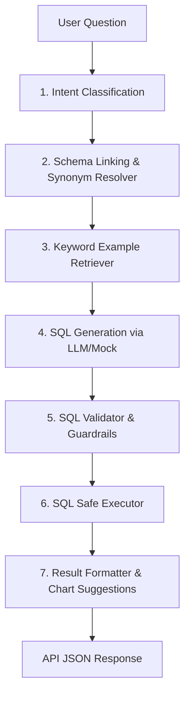

# QueryMind AI - Natural Language to SQL Analytics Engine

QueryMind AI is an advanced Text-to-SQL analytics platform. It translates natural language questions into structured SQL, validates them against security rules (guaranteeing read-only actions), executes the queries against SQLite databases, and formats the response payload with summaries and chart suggestions.

---

## 1. Project Overview

QueryMind AI bridges the gap between non-technical stakeholders and database assets by providing a conversational interface for business intelligence. By analyzing database schemas and natural language intent, it retrieves relevant query examples, generates safe SQL queries, runs them against the target data warehouse, and outputs tabular data alongside visual graph recommendations.

---

## 2. Architecture Summary

The backend system is built with **FastAPI** and orchestrates query parsing, validation, and generation using **LangGraph**.



### Key Modules:
- **Orchestrator (`orchestrator.py` & `graph.py`)**: Coordinates the sequential workflow using LangGraph state graph.
- **Classifier (`classifier.py`)**: Categorizes questions (Simple Select, Aggregate, Join, Temporal, Unsupported/Destructive).
- **Linker (`linker.py`)**: Resolves schema naming mismatches using a dictionary of synonyms.
- **Retriever (`retriever.py`)**: Selects relevant few-shot learning query templates from `admin_config.db` using Jaccard keyword overlap similarity.
- **Generator (`generator.py`)**: Formulates system prompts and communicates with LLMs or a deterministic mock provider.
- **Validator (`validator.py`)**: Employs `sqlglot` to verify syntax, checks that referenced tables are white-listed, blocks non-SELECT actions, and enforces row limits.
- **Executor (`executor.py`)**: Executes read-only queries securely and measures execution latency.
- **Formatter (`formatter.py`)**: Transforms relational rows to dicts, counts results, and suggests chart options (e.g., bar chart parameters).
- **Admin Routers**: Facilitates management of schema synonyms, example queries, guardrail options, configuration values, and user query log history.
- **LangSmith Tracing (`tracing.py`)**: Integrates optional tracing to monitor intermediate node outputs.

---

## 3. Setup Commands

Make sure you have [uv](https://github.com/astral-sh/uv) installed.

Navigate to the `backend` folder and run the following setup commands:

```bash
# Move to backend folder
cd backend

# Create virtual environment
uv venv

# Activate virtual environment (Windows PowerShell)
.venv\Scripts\Activate.ps1

# Activate virtual environment (macOS/Linux)
source .venv/bin/activate

# Install all package dependencies (production + development)
uv sync

# Create local environment config file
cp .env.example .env
```

---

## 4. Seed Commands

The platform utilizes a multi-database approach: `querymind.db` holds business transactional data, and `admin_config.db` retains example scripts, schema mappings, logs, and configurations. Initialize and seed these databases:

```bash
# Seed the business e-commerce database (querymind.db)
uv run python src/querymindai_backend/scripts/seed_db.py

# Initialize administrative configuration database and tables (admin_config.db)
uv run python src/querymindai_backend/scripts/init_admin_db.py

# Seed natural language-to-SQL training examples into administrative DB
uv run python src/querymindai_backend/scripts/seed_examples.py
```

---

## 5. Test Commands

Verify the codebase integrity by running all unit and integration tests:

```bash
uv run pytest
```

---

## 6. Run Server Command

You can run the web server locally using the developer server or package it in a container.

### Local Dev Server:
```bash
uv run uvicorn querymindai_backend.app:app --host 127.0.0.1 --port 8000 --reload
```

### Docker Compose:
To run the server in a containerized environment (mapping port `8000:8000`):
```bash
# From the backend folder containing docker-compose.yml
docker-compose up --build
```

---

## 7. API Examples

### Execute Query API (`POST /query`)
Submit a natural language prompt to trigger the LangGraph execution pipeline.

**Request:**
- **URL**: `http://localhost:8000/query`
- **Method**: `POST`
- **Headers**: `Content-Type: application/json`
- **Body**:
```json
{
  "question": "show top products by revenue",
  "include_sql": true
}
```

**Response:**
```json
{
  "status": "success",
  "sql": "SELECT p.product_name, SUM(oi.quantity * oi.unit_price) AS revenue FROM products p JOIN order_items oi ON p.product_id = oi.product_id JOIN orders o ON oi.order_id = o.order_id GROUP BY p.product_name ORDER BY revenue DESC LIMIT 10;",
  "data": [
    {
      "product_name": "Premium Leather Wallet",
      "revenue": 12000.5
    },
    {
      "product_name": "Wireless Noise-Cancelling Headphones",
      "revenue": 9500.0
    }
  ],
  "summary": "Returned 2 rows.",
  "suggested_chart": {
    "type": "bar",
    "x": "product_name",
    "y": "revenue"
  },
  "error": null
}
```

### Liveness and Readiness Probes (`GET /live`, `GET /ready`)
- **Liveness**: `GET http://localhost:8000/live` returns status information verifying the server is running.
- **Readiness**: `GET http://localhost:8000/ready` checks config load capabilities and database accessibility.

---

## 8. Evaluation Command

Evaluate pipeline accuracy, latency, and guardrail compliance against 25 predefined benchmark questions:

```bash
uv run python src/querymindai_backend/scripts/eval_harness.py
```

After running the evaluation, the harness automatically compiles the metrics and outputs a comprehensive report to `docs/evaluation_report.md`.

---

## 9. Known Limitations

- **SQLite Target Only**: The parser and generator assume SQLite syntax. Moving to PostgreSQL or MySQL requires updating prompt schemas and replacing the DB executor utility.
- **Rule-based Classification**: The classification of questions (simple vs. aggregate vs. join) is primarily rule-based. Unhandled queries might be classified incorrectly.
- **Exact Synonym Matching**: The schema resolver maps explicit synonyms matching exact dictionary configurations. Semantic vector databases or fuzzy search mappings are not used.
- **Mock LLM Default**: When no API keys (e.g. OpenAI keys) are configured in the environment file, the SQL generator falls back to predefined mock outputs for queries.
